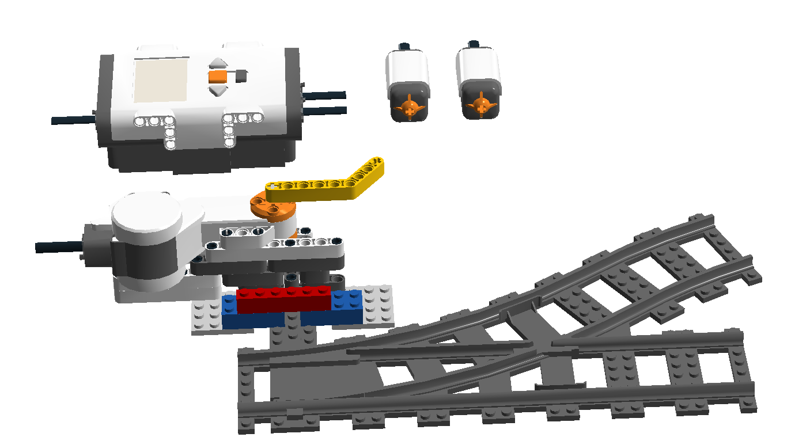
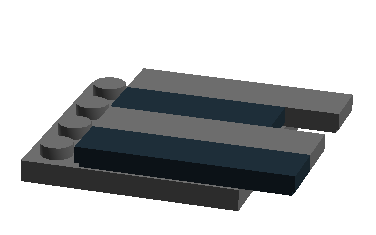
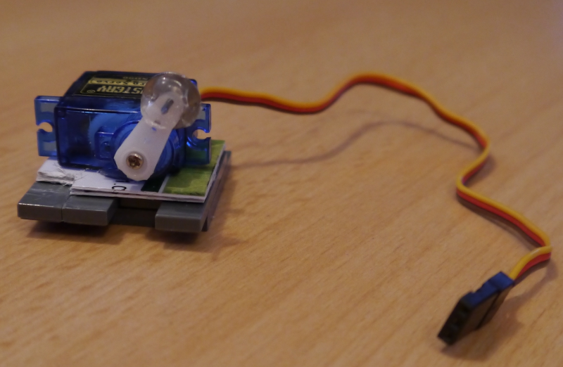
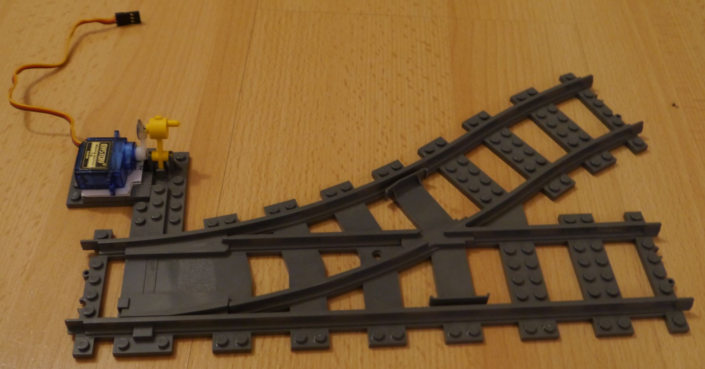
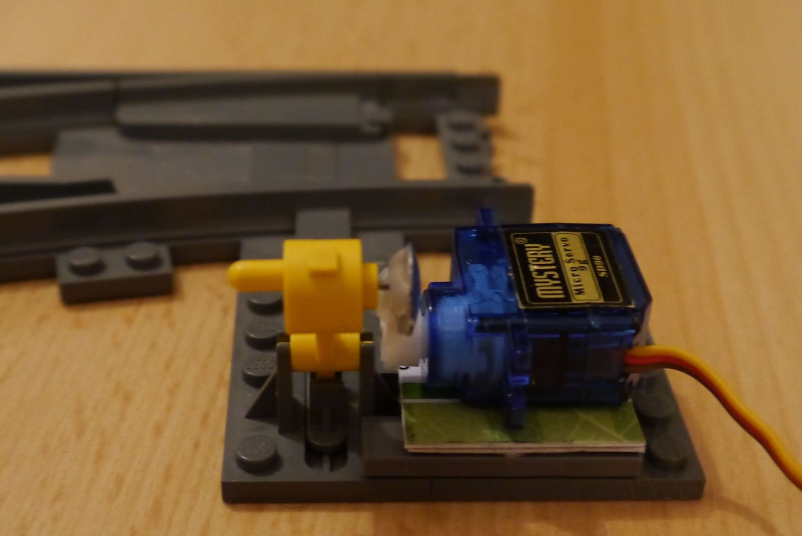
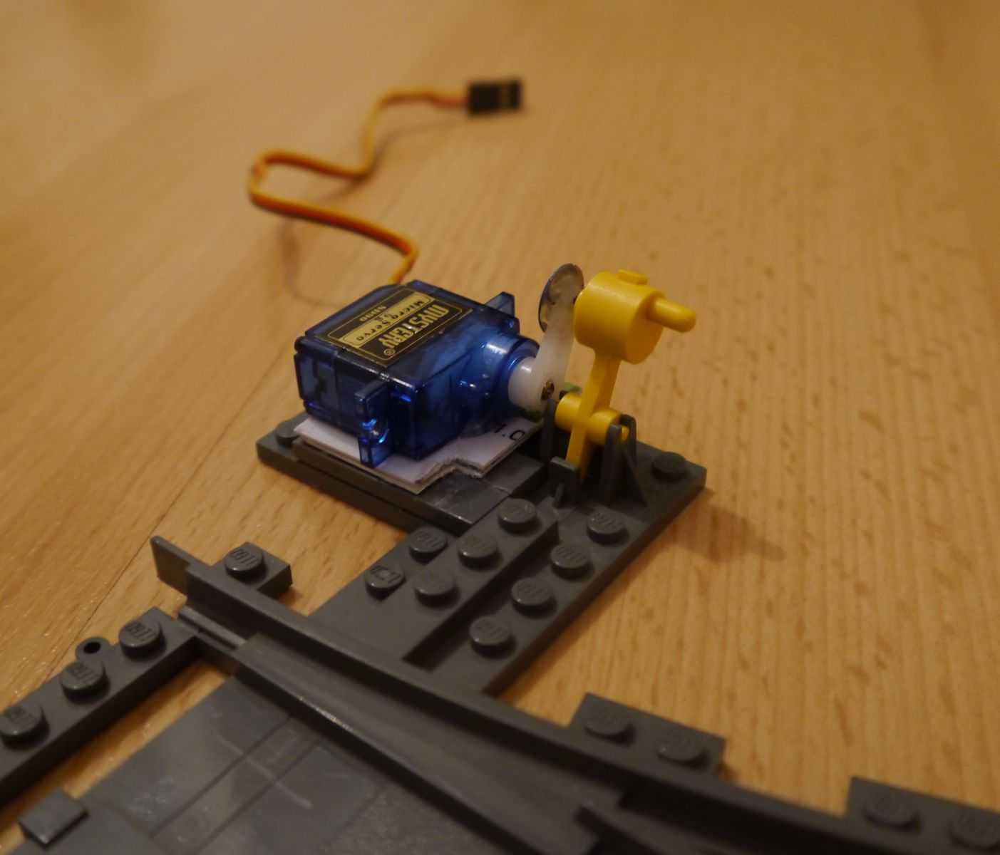
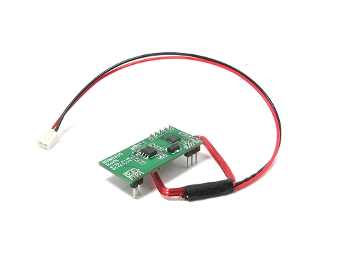
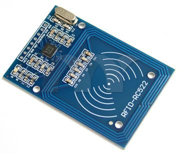

// Global settings
:ascii-ids:
:encoding: UTF-8
:lang: de
:icons: font
:toc: left
:toclevels: 8
:numbered:

= Übersicht
:author: Markus von Rüden

`Q's Train Project` (QTP) dient dazu einen Zug-Fahrbetrieb zu simulieren.
Dabei gilt es Hard- und Softwarekomponenten aufeinander abzustimmen und einen möglichst automatisierten Betrieb zu
ermöglichen.
Der "echte" Zugebetrieb wird dabei von LEGO-Modellen simuliert.
Dieses Projekt beschäftigt sich mit allen auftretenden Fragen und Problemen welche sich dabei ergeben.

== Verwendete Techniken
Die Dokumentation ist mit link:http://asciidoctor.org[Asciidoctor] erstellt.

== Inhalte

=== Materialien

Zur Verfügung stehen folgende LEGO Materialien:

 * 1x LEGO ICE (link:http://www.amazon.de/Lego-60051-City-Hochgeschwindigkeitszug/dp/B00HFPM3IK[60051])
 * 1x LEGO S-Bahn (link:http://www.amazon.de/Lego-4568048-LEGO-City-7938/dp/B003A2JCQ8/ref=sr_1_6?ie=UTF8&qid=1416519366&sr=8-6&keywords=lego+zug[7938])
 * 52x LEGO Schiene gerade (link:http://cache.lego.com/media/bricks/5/2/4279714.jpg[4279714])
 * 97x LEGO Schiene gebogen (link:http://cache.lego.com/media/bricks/5/2/4279717.jpg[4279717])
 * 4x LEGO Weiche rechts (link:http://cache.lego.com/media/bricks/5/2/4516101.jpg[4516101])
 * 4x LEGO Weiche links (link:http://cache.lego.com/media/bricks/5/2/4516092.jpg[4516092])
 * einige LEGO Schienen flexibel (link:http://cache.lego.com/media/bricks/5/2/4535745.jpg[4535745])

Des Weiteren stehen zur Verfügung:

    * ein link:http://raspberrypi.org[Raspberry PI]
    * ein LEGO Mindstorms NXT

=== Streckenaufbau

Zu Beginn wird ein einfacher Streckenaufbau gewählt, welcher mindestens die folgenden Kriterien erfüllt:

 * eine Weiche verbaut
 * alle Streckenabschnitte bilden einen Kreis

Denkbar wäre folgender Streckenaufbau:

image:http://www.duplo-schienen.de/duplo-schienen.de-Beispiel21-Oval-grossem-Aussengleis.png[]
Quelle: http://www.duplo-schienen.de

=== Anforderungen

Dieser Abschnitt enthält alle Anforderungen, welche es zu erfüllen gilt.
Anfangs sind diese eher Ideen als konkrete Anforderungen.
Mit Fortschritt des Projekts ändern sich die Anforderungen ggf.
Lösungen werden anschließend vorgestellt und dokumentiert.

==== Ansteuern der Weichen

Über ein Schaltpult (Software oder Hardware) werden die Weichen umgeschaltet.
Die Weiche darf nicht modifiziert werden (z.B. entfernen der Feder).
Ein manuelles Umschalten an der Weiche selbst durch den Benutzer ist nicht gestattet.

===== Prototyp 1, LEGO Mindstorms NXT

Der erste Prototyp ist mit Hilfe von LEGO Mindstorms realisiert worden.
Der Aufbau ist sehr einfach gehalten.

Die beiden Schalter dienen zur Ansteuerung, des Motors.
Der Schalter rechts stellt die Weiche auf Durchfahrt.
Der Schalter links stellt die Weiche auf "gebogener Zweig".

Beim Drücken eines Schalters, wird der Motor mit einer Kraft von `50%` für `0,25 Sekunden` `vorwärts/rückwärts` angesteuert und `bremst` anschließend.

.LEGO Mindstorms NXT steuert Weiche

*Gewonnene Erkenntnisse*

 * die Kraft des verwendeten Motors reicht aus,
 * es existieren sogar noch Reserven

*Vorteile*

 * es werden nur LEGO-Steine verwendet
 * einfache Software-Lösung
 * simple Baukonstruktion

*Nachteile*

 * "klobige" Baukonstruktion
 * nur drei Weichen ansteuerbar (es existieren nur drei Motoren)

*Downloads*

 * link:1_WeichenSchalter_Lego-Mindstorms-NXT.rbt[Quellcode (.rbt-Datei)]
 * link:1_WeichenSchalter_Lego-Mindstorms-NXT.lxf[Bauplan (.lxf-Datei)]

===== Prototyp 2, Micro Servo

Der zweite Prototyp ist mit einem Micro Servo Motor realisiert.
Dabei kam der Motor _Mystery Micro Servo 9g SD90_ zum Einsatz.
Zur Ansteuerung des Servo-Motors wird ein link:http://www.raspberrypi.org/products/model-b-plus/[Raspberry Pi B+] verwendet.

*Technische Daten SD90 9g* footnote:[http://www.tradesoon.com/pro-cate/toys/electrical-toys/mystery-sd90-servo-for_3439023.htm]
[horizontal]
 * Speed: 0.12 second/60 degrees rotation
 * Torque: 1.3kg @ 4.8V~6V power
 * Comes with full ranged connectivity accessories and mounting screws
 * Dimensions: 53.6 mm x 52.4 mm x 12.5 mm
 * Weight: 24g

Der Motor wird mittels Pulsweitenmodulation (PWM) footnote:[http://www.mikrocontroller.net/articles/Pulsweitenmodulation] mit einer Frequenz von 50 Hz (entspricht einer Periodendauer von 20ms) angesteuert.
Die manuelle Vermessung ergab folgende Wertetabelle:

[cols="3", options="header"]
:===
ms:°:%
0,00:X:0
0,10:X:0,5
0,20:X:1
*0,30*:*0*:*1,5*
*0,65*:*30*:*3,25*
*1,00*:*60*:*5*
*1,35*:*90*:*6,75*
*1,70*:*120*:*8,5*
*2,05*:*150*:*10,25*
*2,40*:*180*:*12*
10,00:X:50
15,00:X:75
20,00:X:100
:===

X = nicht möglich

Zur Befestigung des Micro-Servo-Motors an der LEGO Weiche wurde eine Basis-Plattform aus LEGO-Steinen realisiert.
Anschließend muss der Motor in der richtigen Höhe auf die LEGO Basis-Plattform geklebt werden.
Wichtig dabei ist, dass die Achse des Motors mit der Achse des LEGO Weichenhebels auf einer Linie ist.
Daraus ergibt sich eine Höhe von 8 mm.
Die Höhe der LEGO Basisplattform entspricht 6 mm.
Um die fehlenden 2 mm zu überbrücken wurde eine abgelaufene Bahn-Card mit 1 mm Höhe zurechtgeschnitten und auf die Basis-Plattform geklebt.
Anschließend kann der Motor aufgeklebt werden.

Der einfache Motorhebel wird an einem Ende abgeschnitten und mittig (90° Position) angebracht.

Damit eine physikalische Verbindung zwischen Motor und Weichenhebel besteht wird eine Heftzwecke durch das oberste Loch des Schalthebels gesteckt und ebenfalls verklebt.

Anschließend wurden die zwei Winkel bestimmt um die Weiche zu stellen:

 * 50°
 * 120°

*Gewonnene Erkenntnisse*

 * Die Kraft des verwendeten Motors bei 5V Versorgungsspannung reicht aus

*Nächste Schritte*

 * Verwendung mehrerer Motoren/Weichen
 * Erstellen eines CLI (Command Line Interfaces) zur gezielten Ansteuerung einer Weiche, z.B. _schalte weiche1 1_ für durchfahrt.
 * Bereitstellen eines GEhäuses um die "Elektronik" zu verstecken bzw. zu schützen.

*Probleme*

Einige Weichen ließen sich problemlos steuern, andere wiederum nicht, da diese sehr schwer zu stellen waren.
Mithilfe von WD40 ist dem aber beizukommen.

.LEGO Basis-Plattform

.Micro-Servo auf LEGO Basis-plattform

.Micro-Servo mitgelieferte Teile

.Micro Servo an Weiche 1

.Micro Servo an Weiche 2

.Micro Servo an Weiche 3

*Downloads*

 * link:2_WeichenSchalter_Servo_Plattform.lxf[Bauplan LEGO Basis-Plattform (.lxf-Datei)]
 * link:code/weichenschalter.py[Python Quellcode zur Weichensteuerung]

'''
===== Weiterführendes Material
Folgende Informationen können hilfreich sein:

 * http://xn--jkel-loa.info/15.html --> 9V Weiche, ggf. Anpassungen notwendig. Weiche wird verändert.
 * https://www.youtube.com/watch?v=o-S8ZbZiMNo&feature=relmfu&app=desktop --> sehr kleine Lösung, aber wohl auch Modifizierung an Weiche notwendig.
 * http://www.mikrocontroller.net/topic/292609 --> Interessanter Beitrag
 * http://www.1000steine.de/de/gemeinschaft/forum/?entry=1&id=243726
 * http://www.tausendsteine.de/de/gemeinschaft/forum/?entry=1&id=301222&PHPSESSID=0a02e9eca570cf839209e3ad27557c00
 * http://www.mikrocontroller.net/topic/269954
 * http://www.1000steine.de/de/gemeinschaft/forum/?entry=1&id=305552#id305552
 * Weitere Beiträge über Suchbegriffe wie "LEGO Weiche elektrisch ansteuern"

==== Positionsbestimmung eines Zugs

Ein Zug fährt über die Strecke und am Schaltpult/im Kontrollzentrum ist ersichtlich wo sich der Zug befindet.

Hier sind mehrere Ansätze möglich:

 * RFID/NFC
 * Magnete im "Gleisbett"
 * Lichtschranke am Gleis/Zug
 * Kombination aus allem
 * Barcodescanner am Zug und Barcodes am Gleis
 * Farbsensor am Zug und Farbcode am Gleis
 * Weitere Beiträge über Suchbegriff wie "Gleisbesetztmelder Modelleisenbahn".

Artikelsammlung:

 * http://www.foerstemann.name/lgb/computer/lgb_konzept.pdf
 * http://www.railware.de/doku/tiki-index.php?page=Doku4+Zugidentifikation+mit+Helmo+System
 * http://www.railware.de/doku/tiki-index.php?page=Doku4+R%C3%BCckmeldung+Wie+und+Wo
 * http://www.firma-staerz.de/LEGO/Digitalisierung_des_LEGO_9V-Systems.pdf

===== Prototyp 1, RFID 125 Khz

Auf der Strecke werden mehrere 125 Khz RFID-Tags verteilt.
Ein RFID-Lesegerät wird im LEGO-Zug verbaut und ließt die Karte beim Überfahren aus.

Aufgrund der geringen Baugröße (3,8 x 1,8 x 1,2cm) wurde ein _125Khz RFID RDM6300 - UART_-Lesegerät verwendet.

Ein Auslesen von 125 Khz Tags bei Stillstand des Zuges hat problemlos geklappt.
Im fahrenden Betrieb (auch bei Langsamfahrt) war ein Auslesen der RFID-Tags nicht mehr möglich.

*Gewonnene Erkenntnisse*

 * Das RFID-Lesegerät ließt 125 Khz Tags bei Stillstand des Zuges
 * Ein Auslesen eines Tags im Fahrtbetrieb ist nicht möglich

.RDM6300 RFID 125Khz Lesegerät

===== Prototyp 1, RFID 13,56 MHz

Auf der Strecke werden mehrere 13,56 Mhz RFID-Tags verteilt.
Ein RFID-Lesegerät wird im LEGO-Zug verbaut und ließt die Karte beim Überfahren aus.

Als Lesegerät wurde ein _MIFARE RC522_-Modul verwendet.

Ein Auslesen von 13,56 Mhz RFID-Tags hat sowohl bei Stillstand und während der Fahrt des Zuges funktioniert.
Aufgrund der größeren Baugröße (4,0 x 6,0 cm) war ein dezentes Verbauen im Zug nicht möglich.

*Gewonnene Erkenntnisse*

 * Das RFID-Lesegerät ließt 13,56 Mhz Tags sowohl bei Stillstand als auch während der Fahrt des Zuges
 * Die Baugröße dieses Moduls ist zu groß

*Nächste Schritte*

 * Es wird ein weiteres 13,56 Mhz RFID-Lesegerät mit geringerer Baugröße ausprobiert

.RC522 RFID 13,56 Mhz Lesegerät

==== Streckenabschnitte

Die Strecke wird in Abschnitte eingeteilt.
Auf dem Schaltpult/im Kontrollzentrum ist zu sehen welcher Abschnitt zur Zeit von welchem Zug belegt wird.

Ein Zug welcher in einen "gesperrten" Abschnitt fährt wird automatisch gestoppt.
Ein Weiterfahren dieses Zugs ist nicht mehr möglich. Er muss "resettet" werden (z.B. Aus- und wieder Einschalten)

Interessante Information zu einer möglchen Lösung:

 * http://www.1000steine.de/de/gemeinschaft/forum/?entry=1&id=318552#id318552

==== Richtungsbestimmung

Es ist auf dem Schaltpult/im Kontrollzentrum ersichtlich in welche Richtung ein Zug fährt.

==== Geschwindigkeitsbegrenzung

Auf der Strecke herschen unterschiedliche Geschwindigkeitsbegrenzungen (z.B. keine, 80%, 50%, usw., ggf. auch absolut).

==== Waren

Ein Computerprogramm simuliert "Waren" in Form von Passagieren, Kohle, Güter, Nahrung, Tiere, Autos, usw.

Es gibt mehrere Bahnhöfe. Jeder Bahnhof produziert und konsumiert Waren.

Ein Zug kann Waren transportieren (z.B. Kohle).

Hält ein Zug an einem Bahnhof, werden Waren be- und entladen (sofern vorhanden).

==== Vollautomatischer Betrieb

Der Zugbetrieb ist vollständig automatisiert.
Ein manuelles Eingreifen ist nicht mehr notwendig (vll. sogar möglich?)

==== Mehr von Allem

 * Betrieb auch mit Autos, LKWs, mehr Züge, längere Züge
 * Noch mehr Züge
 * Bahnübergänge
 * Lichtsteuerung (im Zug, auf der Strecke)
 * Kamerasteuerung (im Zug, auf der Strecke)
 * Audiowiedergabe (im Zug, auf der Strecke)
 * usw....

== Ausschlusserklärung
LEGO® ist eine Marke der LEGO Gruppe, durch die die vorliegenden Inhalte jedoch weder gesponsert noch autorisiert oder unterstützt werden.

Alle Logos, Hersteller- und Produktnamen sind Warenzeichen ihrer jeweiligen Hersteller.

== Lizenz
Copyright (c) 2014, Markus von Rüden.

image:https://i.creativecommons.org/l/by-nc-sa/4.0/88x31.png[alt="Creative Commons Lizenzvertrag", link="http://creativecommons.org/licenses/by-nc-sa/4.0/"]

Dieses Werk ist lizenziert unter einer link:http://creativecommons.org/licenses/by-nc-sa/4.0/[Creative Commons Namensnennung - Nicht-kommerziell - Weitergabe unter gleichen Bedingungen 4.0 International Lizenz]
